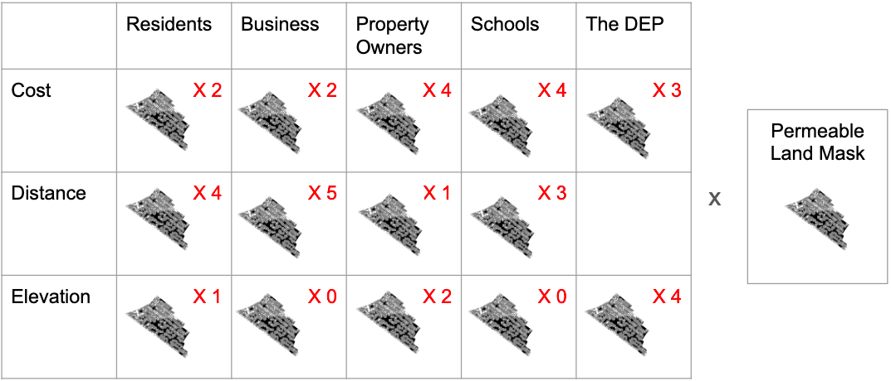
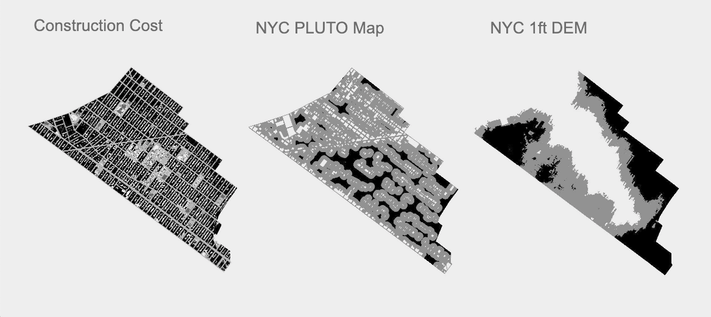
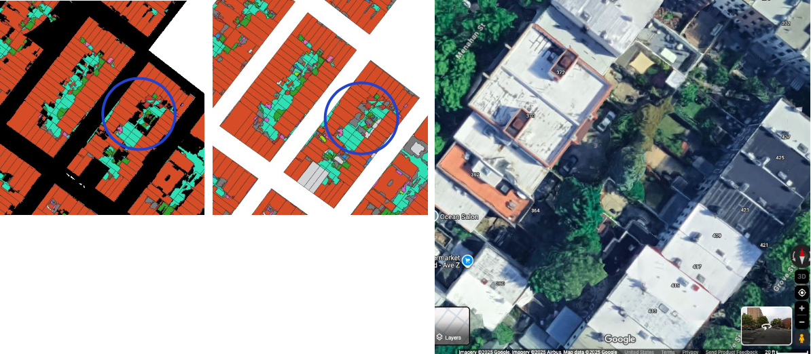

# Negotiating New Permeability Requirements in Bushwick, NY

## Overview

 This project explores how a hypotheical city-mandated 30% neighborhood permeability requirement could be implemented in Bushwick, NY by creating a spatial decision support system (SDSS). Using land cover, property, and elevation data, the tool weighs the priorities of five stakeholder groups and identifies locations of greatest shared benefit for green infrastructure investment.

| **Study Area** | Bushwick, Brooklyn, NY (~ 5 km²) |
|:---|:---|
| **Role** | Solo project |
| **Organization** | Hunter College — GTECH 732 Advanced Geoinformatics |
| **Status** | Completed |

---

## Methods & Tools

**Data Sources**

- `DEP Citywide Impervious Area Study` (NYC Open Data) — existing surface permeability
- `NYC PLUTOMap` (NYC Department of City Planning) — property ownership and stakeholder locations
- `NYC 1-Foot Digital Elevation Model` (NYC Open Data) — elevation as a proxy for flood control effectiveness
- `NYC School Locations` (NYC Department of Education) — school property locations
- `2020 Neighborhood Tabulation Areas` (NYC Department of City Planning) — study area boundary

**Processing Steps**

1. `Calculated` Bushwick's `current permeability` (17.3%) and the `total impermeable land` area that would need to be converted (6,485,642 sq ft) to reach the 30% target
2. `Built three factor rasters` for each of five stakeholder groups — conversion cost, construction disruption, and flood mitigation impact — scaled on a 1–3 index
3. `Using the QGIS Graphical Modeler, applied stakeholder weights to each factor raster` and summed across all stakeholders, then masked out already-permeable land using a binary constraint raster
4. Filtered the resulting 0–100 point output map to `identify the 8,541,805 sq ft of land scoring 80 points or above` as the highest-consensus conversion candidates

**Tools Used**

| Tool | Purpose |
|------|---------|
| QGIS | Primary analysis environment, raster processing, and weighted overlay model |
| QGIS Graphical Modeler | Building and running the multi-layer weighted overlay model |
| GRASS (grow.distance) | Generating distance gradient rasters for each stakeholder group |
| QGIS Raster Calculator | Applying stakeholder weights and combining factor layers |
| QGIS Field Calculator | Ranking land cover converstion cost by permeability, surface type, and ownership |

---

## Key Findings

- `Bushwick is currently only 17.3% permeable` — 12.7 percentage points below the hypothetical 30% requirement, representing a shortfall of 6,485,642 sq ft (0.23 sq miles).
- The weighted overlay model `identified 8,541,805 sq ft of impermeable land scoring 80+ points`, exceeding the area needed and demonstrating that mutual beneficial conversion areas exist even among stakeholders with competing priorities.
- `High-scoring areas were concentrated in large paved spaces at higher elevations`, including commercial parking lots and a school bus depot on the southeast edge of Bushwick — prime candidates for city-incentivized conversion.
- Residential backyards in higher-elevation areas also scored well, suggesting `potential for collaborative block-level green infrastructure schemes`.
- `Streets scored highly` due to a current model limitation in cost ranking, pointing to a key area for refinement in future iterations.

---

## Links

- View technical paper [>>](../assets/Adv_GIS_SDSS_Final_Paper.pdf)
- View slidedeck [>>](../assets/Adv_GIS_SDSS_Presentation.pdf)