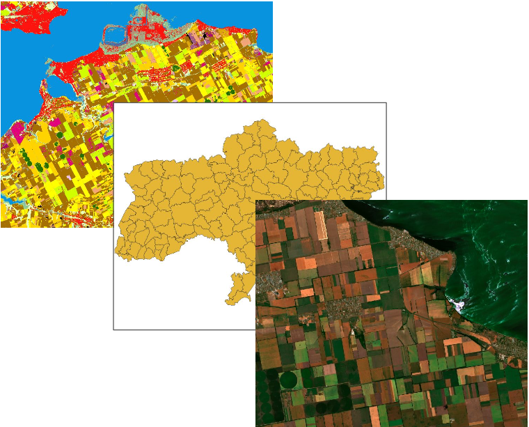
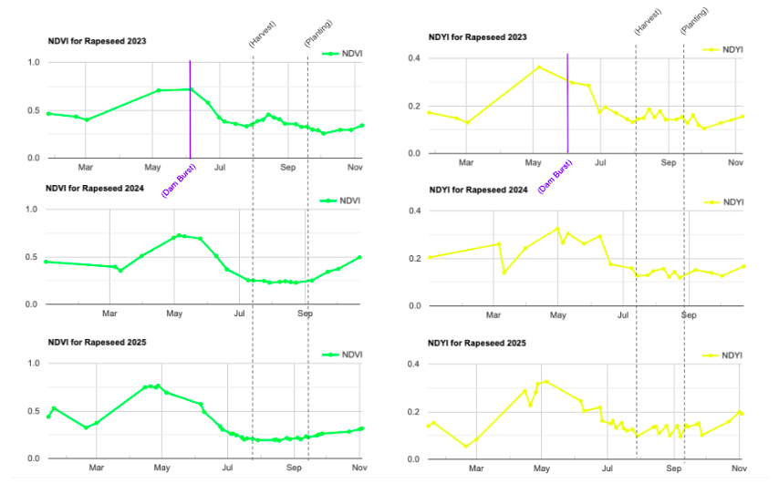

# Long-Term Impact of the Nova Kakhovka Dam Collapse on Rapeseed Production in Vasylivskyi, Ukraine

## Overview

This project uses Sentinel-2 satellite imagery and a Random Forest classifier in Google Earth Engine to quantify the long-term impact of the 2023 Nova Kakhovka Dam collapse on rapeseed crop cover and yield in the Vasylivskyi district of southeastern Ukraine. Because the region is an active conflict zone where ground-truth data collection is limited, the study demonstrates how remote sensing can be used to monitor agricultural disaster impact with minimal in-situ data.

| **Study Area** | Vasylivskyi district, Zaporizhzhia Oblast, Ukraine (~4,308 km²) |
|:---|:---|
| **Role** | Solo project |
| **Organization** | Hunter College — GTECH 713 Remote Sensing |
| **Status** | Completed |

---

## Methods & Tools

### Data Sources

- `Sentinel-2 Level-2A 2019–2025` (European Space Agency / Copernicus) - surface reflectance data for crop classification and analysis
- `EuroCrop Map 2022 of Ukraine` (European Commission Joint Research Centre) -  ground-reference data for model training and validation
- `Ukraine Administrative Boundaries` (UN Office for the Coordination of Humanitarian Affairs) — project study area

### Processing Steps

1. `Training data preparation` — Generated a binary rapeseed / non-rapeseed raster from the 2022 EuroCrop map in QGIS, then sampled 400 random points (200 rapeseed, 200 other) in Google Earth Engine.
2. `Feature image construction` — Built mean May Sentinel-2 composite images (cloud cover < 20%, cloud-masked) for each year 2019–2025, adding NDVI and NDYI (Normalized Difference Yellowness Index) as additional bands, patching cloud gaps with a mean June composite where needed.
3. `Random Forest classification` — Trained a 50-tree Random Forest model on 60% of the 2022 sample data and validated on the remaining 40%, then applied the model to all seven annual composites to produce binary rapeseed crop-cover maps. Water pixels along the Dnieper River were masked out to remove post-flood spectral contamination.
4. `NDVI & NDYI timeseries analysis` — Extracted annual phenological timeseries for classified rapeseed pixels to track vegetation health and flowering timing patterns across years.
5. `Yield estimation` — Recorded peak NDYI for each year and applied a published linear regression (Lukas et al., 2022; R² = 0.90) to estimate per-hectare yield, then multiplied by that year's classified crop area to derive total annual yield estimate in tonnes.
6. `Yield loss calculation` — Compared 2023–2025 crop area and yield estimates against the pre-dam-collapse baseline range (2019–2022) to quantify yield loss.

### Tools Used

| Tool | Purpose |
|------|---------|
| Google Earth Engine (GEE) | Sentinel-2 image compositing, Random Forest classification, NDVI/NDYI timeseries generation |
| QGIS | Generation of binary rapeseed reference raster from EuroCrop map |
| SMILE Random Forest (GEE built-in) | Binary crop-cover classification |
| Sentinel-2 (ESA Copernicus) | Primary multispectral imagery (bands B1–B12, 10–20 m resolution) |

---

## Key Findings

- `The Random Forest model achieved 98.2% overall accuracy` (Kappa = 0.963) on 2022 validation data, with a 99% user's accuracy for rapeseed pixels — confirming that May NDYI is highly effective for distinguishing rapeseed from other land cover.
- `2024 saw a dramatic collapse in crop area`, dropping to 16,225 ha — 52.5% less area than the lowest year on record (30919.89 ha in 2022), indicating the dam collapse had a significant impact on rapeseed planting the season after the event.
- `Yield loss in 2024 was between 43,699–132,994 tonnes`, as compared to the range in yield of pre-dam burst years.
- `NDYI — not NDVI — was the more sensitive indicator of dam impact`: peak NDYI fell to ~0.325 in 2024 (vs. a pre-dam mean of ~0.37) and occurred earlier in the season in both 2023 and 2024, suggesting disrupted crop development patterns rather than simple vegetation loss.
- `Recovery was faster than expected`: by 2025, both crop area (41,461 ha) and yield (122,927 t) had returned to within the pre-dam baseline range, suggesting that rapeseed production in Vasylivskyi is more resilient than expected to canal water system damage.
- `The 2023 season impact was not captured by this method`, as peak NDYI occurred in early May — prior to the June dam collapse — highlighting a methodological limitation for events that occur after peak bloom.

---

## Links

- View code on GEE [>>](https://code.earthengine.google.com/78d35b59d0f97914a825ba4f6232b28e?accept_repo=projects%2Fgee-edu%2Fbook)
- View technical paper[>>](../assets/Crop_AnalysisPaper.pdf)
- View slide deck[>>](../assets/Crop_AnalysisPresentation.pdf)
