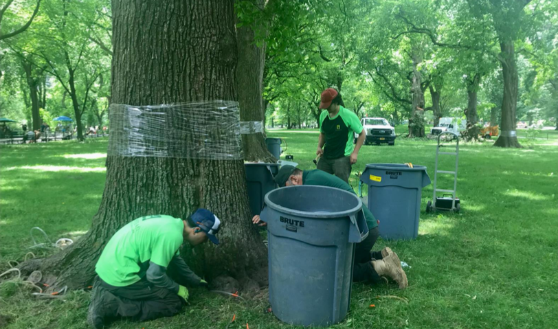
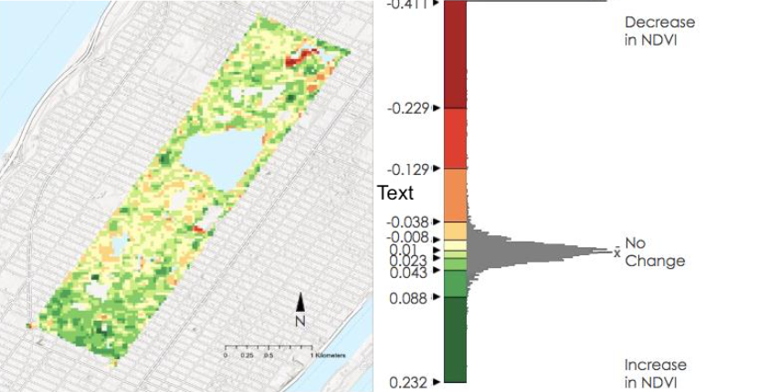

# Assessing Tree Health Conditions in New York City's Central Park with NASA Earth Observation Data

## Overview

This NASA DEVELOP feasibility study used Landsat 8 and 9 satellite imagery to detect changes in forest phenology and assess the health of American elm trees threatened by Dutch Elm Disease (DED) in New York City's Central Park. Working in partnership with the Central Park Conservancy, the team evaluated whether pixel-level NDVI analysis could be integrated into the Conservancy's integrated pest management planning to support more proactive, data-informed tree care decisions.

| **Study Area** | Central Park, New York City, NY (843 acres) |
|:---|:---|
| **Role** | Contributor |
| **Role** | NASA DEVELOP & Central Park Conservancy |
| **Status** | Completed |

---

## Methods & Tools

### Data Sources

- `Landsat 8 & 9 (OLI / OLI-2), 2014–2023` (NASA / USGS via Google Earth Engine) - multispectral imagery (30 m, 16-day revisit) used for all NDVI and phenology analysis
- `NYC LiDAR-Derived Land Cover (2017)` (NYC Office of Technology and Innovation) - 1-foot resolution point cloud used to extract the Central Park tree canopy mask
- `Central Park Conservancy In Situ Data` (Central Park Conservancy) - Tree location, species, canopy dimensions, management history, and recorded DED occurrences provided directly by the partner
- `GHCN-Daily Weather Station Data, 2000–2023` (Global Historical Climatology Network) - daily temperature (min/max) and precipitation used for Growing Degree Day and beetle spread analysis

### Processing Steps

1. `Tree canopy extraction` — Used LiDAR-derived land cover to isolate the Central Park tree canopy, then intersected it with Conservancy zone shapefiles to create elm-specific zonal polygons for the four areas of interest: The Mall, The Ramble, The North Woods, and Fifth Avenue.
2. `NDVI time series construction` — Filtered Landsat 8 and 9 collections for <30% cloud cover across the full study period (January 2014 – July 2024), applied QA cloud masking, and computed NDVI for each acquisition date in Google Earth Engine.
3. `Land surface phenology analysis` — Applied Generalized Additive Model (GAM) analysis to NDVI time series to extract start-of-season, end-of-season, and peak vegetation dates for each year from 2015 to 2023. Produced annual deviation maps by subtracting each year's vegetative-season mean NDVI from the 10-year average.
4. `Growing Degree Day (GDD) and beetle spread analysis` — Calculated cumulative GDD (base 52°F from March 1) and cumulative precipitation up to the date of the first DED-related tree removal each year. Classified years as wet, normal, or dry using precipitation quantile thresholds to correlate climate conditions with beetle spread timing.
5. `Elm tree mask construction` — Built canopy radius buffers around individual elm tree points using crown diameter data; filled missing canopy measurements via linear regression on DBH (R² = 0.61), with the dataset mean applied to the remaining records lacking both fields.
6. `DED detection via logistic regression` — Spatially joined pixel-level NDVI change data with tree location and disease activity records, labeled pixels as DED-positive or DED-negative, and ran a logistic regression model to assess the ability of Landsat NDVI to distinguish unhealthy from healthy elm canopies.

### Tools Used

| Tool | Purpose |
|------|---------|
| Google Earth Engine (GEE) | Landsat image filtering, cloud masking, NDVI computation, and time series export |
| ArcGIS Pro | Spatial join of tree point data to Landsat pixels; contingency table analysis for validation |
| Python | GAM analysis for phenology metrics; GDD and precipitation visualization |
| Landsat 8 & 9 (NASA/USGS) | Primary multispectral imagery for all vegetation analysis |
| NYC LiDAR (OTI) | Tree canopy mask derivation |

---

## Key Findings

- `The logistic regression model detected unhealthy (DED-infected) elm canopies with 71% precision` (F-1 score: 0.71), demonstrating that Landsat-derived NDVI change is a viable signal for identifying diseased trees at the pixel level.
- `Healthy canopy detection was less reliable at 41% precision`, likely due to the Conservancy's active treatment program masking disease signals, the 30 m pixel resolution mixing healthy and infected crowns, and natural NDVI variability on the same order of magnitude as early DED symptoms.
- `Growing season onset was consistent year to year`, typically beginning between mid-April and mid-May, with peak NDVI occurring in June–August and senescence in September — establishing a reliable phenological baseline for future anomaly detection.
- `Elm bark beetle spread is driven by both heat and moisture`: years with higher cumulative GDD at first tree removal tended to be drier, while beetles spread at lower GDD thresholds in wet years — highlighting the need to incorporate both temperature and precipitation into pest management timing models.
- `The Ramble and North Woods showed consistently higher NDVI` than Fifth Avenue and The Mall across all study years, reflecting their denser natural canopy versus the more manicured, high-traffic zones of the park.
- `Annual NDVI deviation maps successfully identified construction-related canopy disturbance` (e.g., the 2023 Harlem Meer Center project) but were better suited to detecting broad canopy changes than pinpointing individual DED events, pointing toward higher-resolution data as a priority for future work.

---

## Links

- View technical paper [>>](https://ntrs.nasa.gov/citations/20240010770)
- View presentation [>>](https://ntrs.nasa.gov/citations/20240009452)

