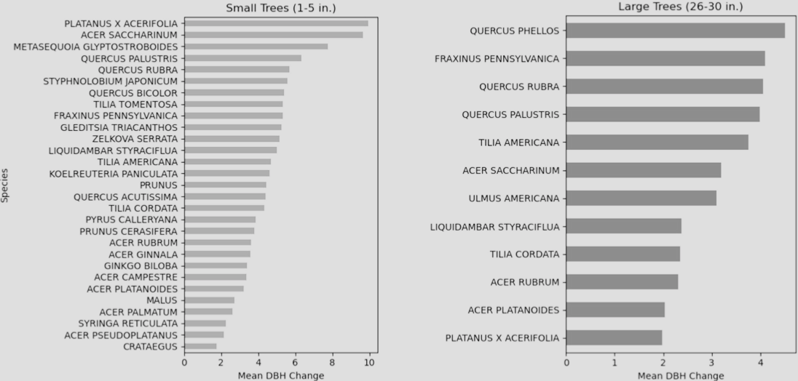

# Exploring Tree Growth in NYC

## Overview

An analysis of street tree growth across New York City between 2005 and 2015, using two rounds of the NYC Street Tree Census to track diameter change by species and neighborhood. The project addresses the methodological challenge of linking individual trees across datasets that share no common ID.

| **Study Area** | New York City (all five boroughs) (~780 km²) |
|:---|:---|
| **Role** | Solo project |
| **Organization** | Hunter College — GTECH 731 Geocomputation |
| **Status** | Completed |

---

## Methods & Tools

### Data Sources

- `NYC Street Tree Census 2005` (NYC Open Data) - tree data
- `NYC Street Tree Census 2015` (NYC Open Data) - tree data
- `202 Neighborhood Tabulation Areas` (NYC Open Data) - boundaries for summary statistics

### Processing Steps

1. `Year labeling & concatenation` — Added a `year` column to each census dataset (2005 & 2015) and concatenated them into a single GeoDataFrame.
2. `Tree ID creation` — Generated a `tree_id` for every unique BBL (Borough Block Lot Location ID) + Latin species combination, treating trees at the same address with the same species as the same individual across years.
3. `Duplicate removal` — Identified and dropped any BBL–species pair that appeared more than once within a single census year to avoid false matches.
4. `Joining & DBH change calculation` — Performed an inner join on `tree_id` between the 2005 and 2015 datasets to produce a matched pair table, then computed `dbh_change` (diameter at breast height difference) for each tree.
5. `Spatial aggregation` — Joined matched trees to NTA (Neighborhood Tabulation Area) boundaries and computed mean DBH change per neighborhood for mapping.

### Tools Used

| Tool | Purpose |
|------|---------|
| Python / pandas | Data cleaning, ID generation, duplicate removal |
| GeoPandas | Spatial joins, CRS management, shapefile I/O |
| Matplotlib | Bar charts of mean DBH change by species |
| Cartopy / contextily | Choropleth maps of growth by neighborhood |
| QGIS | Visual QA of tree point overlaps between census years |

---

## Key Findings

- `London Planetree (*Platanus × acerifolia*)` showed the highest mean DBH change among small trees (1–5 in. starting diameter), followed closely by `Sugar Maple (*Acer saccharinum*)` and `Dawn Redwood (*Metasequoia glyptostroboides*)`.
- Among large trees (26–30 in. starting diameter), `Willow Oak (*Quercus phellos*)` led growth, with `Green Ash (*Fraxinus pennsylvanica*)` and `Red Oak (*Quercus rubra*)` also ranking near the top.
- Spatially, small-tree growth was highest in scattered neighborhoods across the Bronx and Queens, while large-tree growth showed a more varied pattern with hotspots in parts of Staten Island and northern Manhattan.
- Linking trees across census years required a novel BBL + species matching approach; after removing duplicates, the final matched dataset contained `~101,837 tree pairs` spanning 2005–2015.

---

## Links

- View code [>>](../assets/Tree_census_Paramore_Final_Project.ipynb) 
- View slidedeck [>>](../assets/Tree_census_Geocomp Final Presentation.pdf)